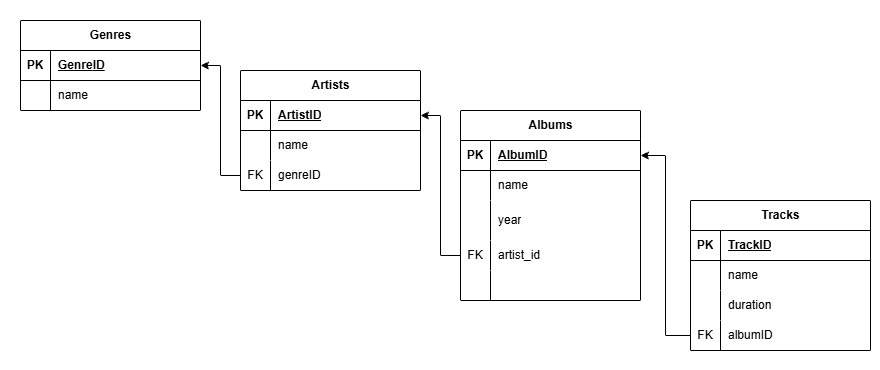

# Music Database Schema

## Tables

### Genre
- **genre_id** (PK)
- **name**

### Artist
- **artist_id** (PK)
- **name**
- **genre_id** (FK → Genre.genre_id)

### Album
- **album_id** (PK)
- **title**
- **year**
- **artist_id** (FK → Artist.artist_id)

### Track
- **track_id** (PK)
- **title**
- **duration**
- **album_id** (FK → Album.album_id)

## Relationships

- Genre 1 → N Artist
- Artist 1 → N Album
- Album 1 → N Track

